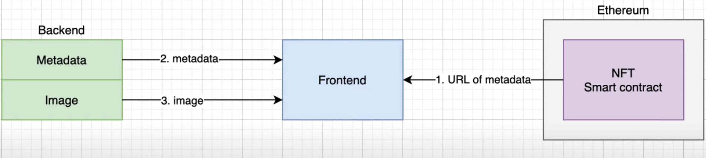

# NFT study

## Concept

### ERC20 vs ERC721

"lumped together" as a nuber in a ledger => assets have its ownership individually and atomically tracked
### How to store

every NFT stores as a unit256 ID in a ERC-721 compatible smart contract, the pair (contract address, uint256 tokenID) is globally unique in the chain.

### How to transfer ownership

transferFrom

- The owner of an NFT

- An approved address of an NFT

- An authorized operator of the current owner of an NFT

## Architecture



## How to run the code

### Smart contract

```
npm run migrate
```
Currently the target Ethereum blockchain is ropsten chain, you can change it in truffle-config.js. After configured your own mnemonic words in .secret file, you can run the above command to deploy the smart contract to the target chain and intial a NFT creation with ID 0.

The smart contract at ropsten network: [https://ropsten.etherscan.io/address/0xa48E498D467cef99ca714700506f4Eeb3B34f50C](https://ropsten.etherscan.io/address/0xa48E498D467cef99ca714700506f4Eeb3B34f50C)

The smart contract will return the NFT uri to any request with specific ID. 
### Backend

```
npm run start
```
The server is a HTTP API server to serve the details meta data and the binary file.

### Frontend

```
npm run dev
```
The client connects to Etherem network with metamask and download the nft meta data, binary file, finaly display it. 